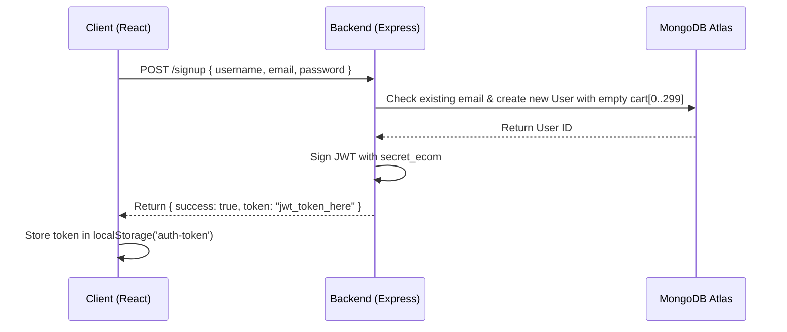

# 🛍️ Shoppers-Stop — Full-Stack E-Commerce Platform

[](https://reactjs.org/)
[](https://react.org)
[](https://expressjs.com)
[](https://www.mongodb.com/)
[](https://nodejs.org)

**Shoppers-Stop** is a comprehensive, decoupled full-stack e-commerce web application built using the **MERN Stack** (MongoDB, Express.js, React.js, Node.js). The platform is divided into three autonomous modules: a responsive customer-facing shopping application, a dedicated inventory admin panel, and a centralized RESTful API backend server.

---

## 🏛️ System Architecture

The project follows a decoupled client-server architecture where two independent React Single Page Applications (SPAs) communicate with a single Express REST API backend connected to MongoDB Cloud Atlas.

```
┌────────────────────────────────────────────────────────────────────────┐
│                          SHOPPERS-STOP SYSTEM                          │
├──────────────────────────────┬──────────────────────────┬──────────────┤
│       Customer App           │     Backend API Server   │ Admin Panel  │
│      (React + Context)       │  (Node + Express + JWT)  │ (React SPA)  │
│         Port: 3000           │        Port: 4000        │  Port: 3001  │
└──────────────┬───────────────┴────────────┬─────────────┴──────┬───────┘
               │                            │                    │
               │ REST API / JSON            │ Mongoose ODM       │ REST API / FormData
               ▼                            ▼                    ▼
     ┌───────────────────┐        ┌───────────────────┐    ┌─────────────┐
     │   Local Storage   │        │   MongoDB Atlas   │    │ Local Disk  │
     │  (JWT Auth Token) │        │ (Cloud Database)  │    │  (/upload)  │
     └───────────────────┘        └───────────────────┘    └─────────────┘
```

### Module Breakdown
1. **`frontend` (Customer Application - Port `3000`)**: The customer-facing storefront where users can browse products by category, view item details, manage their shopping carts, and authenticate.
2. **`admin` (Admin Dashboard - Port `3001`)**: An inventory management portal enabling store operators to add new merchandise, upload product images, and remove obsolete inventory.
3. **`backend` (API Server - Port `4000`)**: The centralized RESTful API server handling data validation, user authentication, cart calculations, file storage, and database persistence.

---

## 🛠️ Technology Stack

### Client-Side (Frontend & Admin Panel)
* **React.js (`v18.2.0`)**: Component-based UI library utilizing functional components and hooks (`useState`, `useEffect`).
* **React Router DOM (`v6.15.0`)**: Declarative client-side routing for seamless navigation without full page reloads (`<BrowserRouter>`, `<Routes>`, `<Route>`).
* **React Context API (`ShopContext.jsx`)**: Built-in state management architecture for synchronizing global inventory feeds and shopping cart state across components.
* **Vanilla CSS**: Custom component-scoped styling using modular `.css` sheets (flexbox, grid layouts) without reliance on external utility frameworks.
* **Create React App / Webpack (`v5.0.1`)**: Development server and production bundling toolchain.

### Server-Side (Backend API)
* **Node.js**: Asynchronous JavaScript runtime environment.
* **Express.js (`v4.18.2`)**: Fast, minimalist web framework used to define HTTP endpoints, configure middleware, and serve static assets.
* **MongoDB Atlas**: Cloud-hosted NoSQL document database.
* **Mongoose (`v7.5.0`)**: Object Data Modeling (ODM) library enforcing schema integrity, validation rules, and asynchronous database queries.

### Security, File Storage & Middleware
* **JSON Web Token (`jsonwebtoken` `v9.0.2`)**: Stateless authentication mechanism encrypting user identity into tokens signed with `'secret_ecom'`.
* **Multer (`v1.4.5`)**: Node.js middleware for handling `multipart/form-data`. Configured with `diskStorage` to intercept image uploads and save them locally to `/upload/images/`.
* **CORS (`cors` `v2.8.5`)**: Cross-Origin Resource Sharing middleware allowing secure communication across ports `3000`, `3001`, and `4000`.
* **Body-Parser (`v1.20.2`)**: Parses incoming JSON request bodies into `req.body`.

---

## 🔄 End-to-End Workflow & Data Flow

### 1. Authentication & Security Flow

* **User Registration (`POST /signup`)**: Validates email uniqueness, initializes a default 300-item zero-quantity cart object, stores the account in MongoDB, and issues a signed JWT.
* **User Login (`POST /login`)**: Verifies plaintext credentials against stored user records and returns the authentication token.
* **Session Persistence**: The client stores the JWT in `localStorage`. For protected routes (like cart modifications), the token is attached to the HTTP `'auth-token'` header. A custom backend middleware (`fetchuser`) decodes this token to identify the acting user.

---

### 2. E-Commerce Customer Workflow
* **Global Inventory Synchronization (`ShopContext.jsx`)**: Upon mounting, the application fetches the entire product catalog from `GET /allproducts`. If a valid JWT exists in local storage, it simultaneously fetches the customer's persisted cart quantities via `POST /getcart`.
* **Dynamic Feed Filtering**:
  * **Home Page (`/`)**: Displays curated lists fetched from `GET /popularinwomen` (top 4 women's items) and `GET /newcollections` (latest 8 additions).
  * **Category Navigation (`/mens`, `/womens`, `/kids`)**: Dynamically filters the global product catalog based on the active category prop.
  * **Product Detail (`/product/:productId`)**: Displays single-item views and fetches 4 related items via `POST /relatedproducts`.
* **Optimistic Cart Management**:
  * Clicking **"Add to Cart"** immediately updates the local React state for instantaneous UI feedback while dispatching a background `POST /addtocart` request with the item ID and JWT token.
  * Clicking **"Remove from Cart"** decrements local quantities and synchronizes with `POST /removefromcart`.
  * Helper functions (`getTotalCartAmount`, `getTotalCartItems`) dynamically compute subtotals and badge counts on the fly by cross-referencing cart quantities with product pricing.

---

### 3. Admin Inventory Management Workflow
* **Image Uploading (`POST /upload`)**: When creating inventory in `AddProduct.jsx`, the admin selects an image file. It is transmitted as `FormData` to the backend where **Multer** renames it with a timestamp (e.g., `product_1700000000.png`) and saves it to `/upload/images/`. Express serves this folder statically, returning a public URL string.
* **Adding Inventory (`POST /addproduct`)**: The admin panel transmits metadata (name, description, category, pricing, image URL). The backend calculates the next incremental integer ID (`last_product.id + 1`) and persists the Mongoose document.
* **Removing Inventory (`POST /removeproduct`)**: Clicking the delete icon in `ListProduct.jsx` dispatches the product ID to the backend, which executes `Product.findOneAndDelete()`.

---

## 🗄️ Database Schema Reference

### Users Model (`Users`)
```json
{
  "name": "String",
  "email": "String (Unique)",
  "password": "String",
  "cartData": {
    "0": 0,
    "1": 2,
    "2": 0,
    "...": 0
  },
  "date": "Date (Default: Date.now())"
}
```

### Product Model (`Product`)
```json
{
  "id": "Number (Required, Auto-incremented)",
  "name": "String (Required)",
  "description": "String (Required)",
  "image": "String (Required, URL Path)",
  "category": "String (women | men | kid)",
  "new_price": "Number",
  "old_price": "Number",
  "avilable": "Boolean (Default: true)",
  "date": "Date (Default: Date.now())"
}
```

---

## 📡 API Endpoints Reference

| HTTP Method | Endpoint | Description | Auth Required? |
| :---: | :--- | :--- | :---: |
| `POST` | `/signup` | Registers a new account and initializes empty cart | ❌ No |
| `POST` | `/login` | Authenticates credentials and returns JWT token | ❌ No |
| `GET` | `/allproducts` | Returns the entire active product inventory | ❌ No |
| `GET` | `/newcollections` | Returns the latest 8 added products | ❌ No |
| `GET` | `/popularinwomen` | Returns top 4 products in the women's category | ❌ No |
| `POST` | `/relatedproducts`| Returns 4 products matching a requested category | ❌ No |
| `POST` | `/upload` | Receives multipart image file via Multer and returns static URL | ❌ No |
| `POST` | `/addproduct` | Auto-increments ID and creates a new product in MongoDB | ❌ No |
| `POST` | `/removeproduct` | Deletes a product from inventory by numeric ID | ❌ No |
| `POST` | `/addtocart` | Increments cart quantity for a specific product ID | 🔒 Yes (JWT) |
| `POST` | `/removefromcart` | Decrements cart quantity for a specific product ID | 🔒 Yes (JWT) |
| `POST` | `/getcart` | Retrieves the authenticated user's current cart mapping | 🔒 Yes (JWT) |

---

## 🚀 Getting Started & Local Setup

### Prerequisites
* **Node.js** (`v16+` recommended)
* **npm** or **yarn**
* A **MongoDB Cloud Atlas** connection string (or local MongoDB server)

### 1. Backend Server Setup
```bash
# Navigate to backend directory
cd backend

# Install server dependencies
npm install

# (Optional) Update the MongoDB connection string in index.js
# mongoose.connect("mongodb+srv://<user>:<password>@cluster0...");

# Start the Express API server
npm start
# Server will start running on http://localhost:4000
```

### 2. Customer Frontend Setup
```bash
# Open a new terminal and navigate to frontend directory
cd frontend

# Install client dependencies
npm install

# Start the React development server
npm start
# Application will launch at http://localhost:3000
```

### 3. Admin Panel Setup
```bash
# Open a new terminal and navigate to admin directory
cd admin

# Install admin dashboard dependencies
npm install

# Start the Admin development server
npm start
# Dashboard will launch at http://localhost:3001
```
